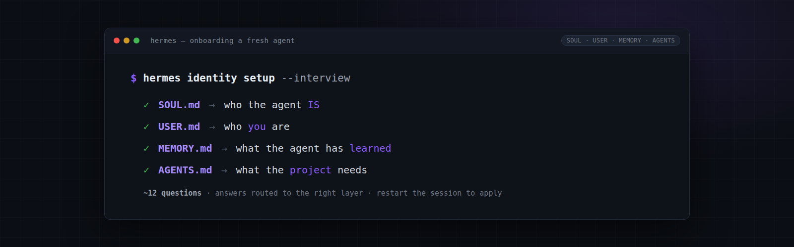

# Hermes Identity Setup

  

A skill for giving a fresh Hermes agent a clear identity and sense of purpose on first start. Mirroring how a new hire is onboarded, it maps every piece of the agent's "self" to the right file, runs a short interview to learn about the user, and routes each answer to the correct layer — so the agent knows who it is, who you are, and what it has already learned.

## Why it exists

A default Hermes agent starts blank: no persona, no profile of its user, no working knowledge. That makes early sessions generic and forgetful. This skill fixes the blank slate in one onboarding pass.

## The four identity layers

Hermes is shaped by four markdown layers, each with a **different job and a different writer**. Don't dump content into all of them — route each fact where it belongs.

| File | Holds | Writer | Aka |
|------|-------|--------|-----|
| **`SOUL.md`** | Agent identity: personality, tone, voice, style-avoids | User | *who the agent IS* |
| **`USER.md`** | User profile: your name, role, prefs, communication style | Agent | *who YOU are* |
| **`MEMORY.md`** | Agent's notes: environment facts, conventions, lessons | Agent | *what the agent has LEARNED* |
| **`AGENTS.md`** | Project instructions / rules | User | *what the PROJECT needs* |

## What the skill does

1. **Agrees on target files** — SOUL.md (persona), USER.md (profile), MEMORY.md (always-know facts), or a project-level AGENTS.md.
2. **Runs a short interview** (~12 questions, kept light — not a tax form), with every answer tagged for the file it belongs in.
3. **Routes each answer** — persona answers go to SOUL.md; facts about you go to USER.md; environment/convention notes go to MEMORY.md. The `memory` tool handles USER.md and MEMORY.md saves, merging and budget management automatically.
4. **Tells you to restart the session** — all identity files are a frozen snapshot taken at session start, so edits apply from the *next* session.

## Using it

Ask the agent to set up or refresh its identity ("set up your profile", "refresh your identity", "onboard me"). The skill runs the interview automatically and files your answers into the correct layer.

## Key gotchas

- **SOUL.md and USER.md never feed each other.** Facts about you belong in USER.md, never SOUL.md.
- **USER.md and MEMORY.md are agent-written**, not hand-edited — route answers through the `memory` tool.
- **Memory is a small, finite budget** — the skill teaches a Tier 1 / Tier 2 split and consolidates stale entries to make room.